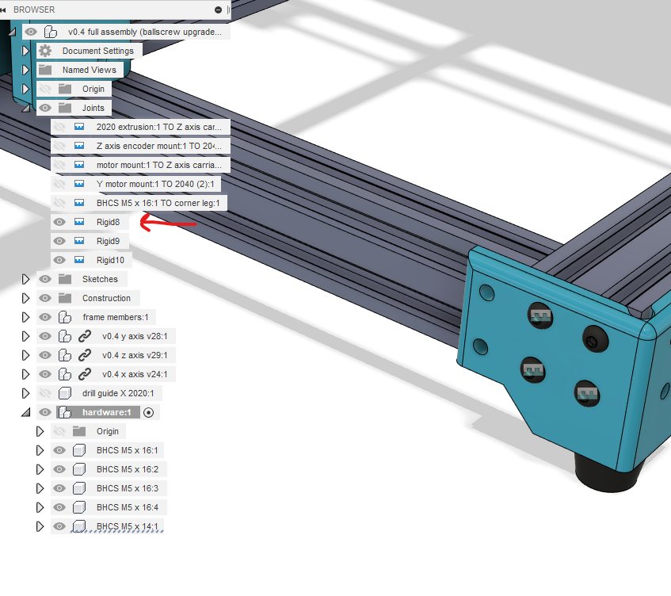
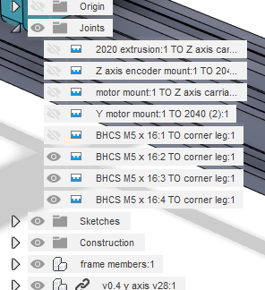

# Autodesk Fusion 360 Component Joint Auto-Renamer

This is an add-in for Fusion 360 that will automatically rename joints using the name of each component making up that joint.

Joints will be automatically renamed using this pattern when saving the design: `component1:1 TO component2:1`

Note that this will happen regardless of your previous choice of name for a joint, so consider that for your needs. I consider this a temporary feature and will be working to make it ignore trying to rename joints with non-default names.

## Screenshots
Newly created joints with default names

Automatically renamed joints immediately upon saving the design

